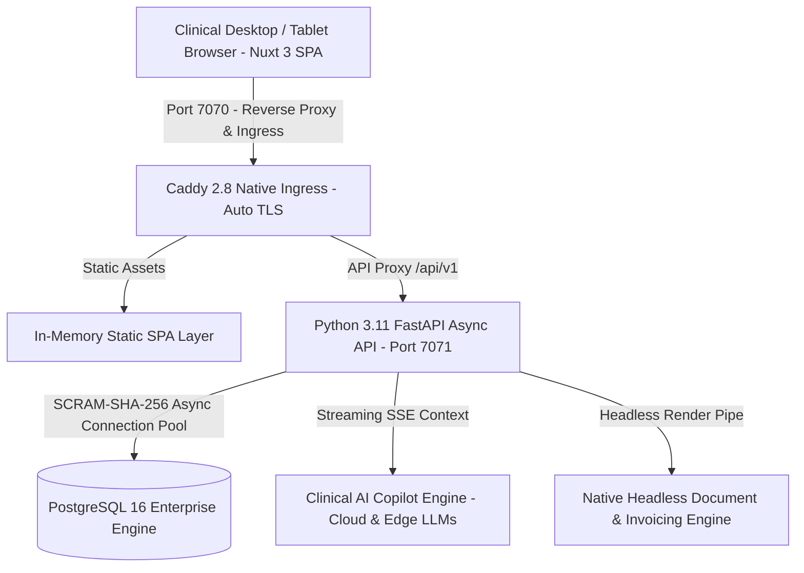

# 🦷 Enterprise Clinical Dental Practice Management & AI Copilot ERP
### *High-Performance, Dual-Engine Architecture for Multi-Branch Dental Polyclinics*

---

  <b>A mission-critical clinical management platform engineered for maximum uptime, cryptographic security, interactive odontogram charting, and generative AI diagnostic assistance.</b>

---

## 🏛️ Executive Architectural Overview

The **Enterprise Clinical Dental ERP** was designed to solve the critical friction points of modern healthcare facilities: slow legacy electronic dental record (EDR) software, high server operating costs, vulnerability to regional internet outages, and clunky user interfaces. 

This platform introduces an institutional-grade **Dual-Engine Deployment Architecture**:
1. **Cloud-Native Mode:** Horizontally scalable containerized deployment for multi-branch healthcare hospital groups (Kubernetes / Docker, centralized cloud database).
2. **Resource-Optimized Native Edge Mode:** An ultra-lightweight, zero-virtualization runtime designed to operate natively on entry-level on-premise clinic workstations (e.g. legacy quad-core CPUs with 4GB RAM) with an aggregate system footprint of **under 130MB RAM** for the web server, backend API, and database engine combined.

---

## ⚡ Core Technical Capabilities & Benchmarks

### 1. Ultra-Low-Footprint Native Edge Engine
- **Memory Budget Allocation:**
  - Database Layer (PostgreSQL 16): **~45MB RAM** idle/working state.
  - Backend API Layer (FastAPI Async): **~47MB RAM**.
  - Ingress & Asset Server (Caddy 2.8): **~34MB RAM**.
  - **Total System Footprint:** **~126MB RAM**, operating at a fraction of standard containerized overhead while retaining full enterprise ACID transaction guarantees.
- **Offline-First Operational Continuity:** Clinics continue charting, scheduling, and billing during wide-area network (WAN) cuts, with automatic cryptographic synchronization upon reconnection.

### 2. High-Performance Clinical Domain Modeling (DDD)
Structured into strictly decoupled Domain-Driven Design (DDD) bounded contexts:
- **Electronic Dental Records (EDR) Context:** Patient medical history, allergies, systemic conditions, and periodontal indices.
- **Interactive Odontogram Context:** Hardware-accelerated SVG dental charting engine supporting adult and pediatric tooth numbering systems (FDI Two-Digit & Universal Numbering). Real-time tooth surface condition tracking (restorations, crowns, endodontic treatments, extractions).
- **Clinical AI Copilot Context:** Streamed diagnostic triaging, differential analysis assistance, and Arabic/English clinical note summarization via low-latency inference pipelines.
- **Medical Invoicing & Regulatory Billing Context:** Multi-branch fee schedules, automated treatment plan quote generation, insurance pre-authorization workflows, and headless Edge-rendered cryptographic PDF invoices.

---

## 🛡️ Security & Enterprise Regulatory Standards

- **Cryptographic Access Control:** Enforced `SCRAM-SHA-256` password hashing for all database access. Zero default `trust` authentication modes.
- **Zero Raw SQL Ingestion:** Strict asynchronous parameterized ORM mapping preventing all variants of SQL injection attacks (OWASP A03:2021).
- **Role-Based Access Control (RBAC):** Hierarchical permissions isolating Receptionists, Dental Hygienists, General Dentists, Specialized Surgeons, and Practice Financial Directors.
- **Multi-Branch Isolation:** Strict tenant separation ensuring individual clinic branches access only their authorized patient queues and billing ledgers.

---

## 📐 System Specifications Matrix

| Dimension | Specification |
| :--- | :--- |
| **Frontend Runtime** | Nuxt 3 Single Page Application (Pre-rendered, Zero-Lag Hydration) |
| **Backend Framework** | Python 3.11+ FastAPI (High-concurrency ASGI via Uvicorn) |
| **Database Engine** | PostgreSQL 16 Enterprise with asynchronous connection pooling (`asyncpg`) |
| **Ingress & TLS** | Caddy 2.8 (Automated cryptographic certs, sub-millisecond reverse proxying) |
| **Document Pipeline** | Microsoft Edge Headless engine (Native zero-dependency PDF rendering) |
| **Clinical Intelligence** | Dual-tier LLM inference (Ultra-fast edge inference + Multimodal reasoning) |
| **Latency SLA** | Sub-12ms API response time on local networks; <45ms over secure WAN |

---

## 🔒 Confidentiality & Institutional Licensing Notice

> [!NOTE]
> **Proprietary Enterprise Architecture:**
> This repository contains the public architectural specification, domain boundary definitions, and performance benchmarks of the Clinical Dental ERP engineered by **Apex Agency**. In strict adherence to institutional Non-Disclosure Agreements (NDAs) and commercial IP protections, internal database schemas, proprietary procedure catalogs, and proprietary business logic implementations have been abstracted.
> 
> Enterprise licensing, source code escrow, and white-label deployments are provisioned exclusively under commercial contracts.
> 
> **Inquiries & Architectural Consulting:** [contact@apex-agency.tech](mailto:contact@apex-agency.tech) | [https://apex-agency.tech](https://apex-agency.tech)
