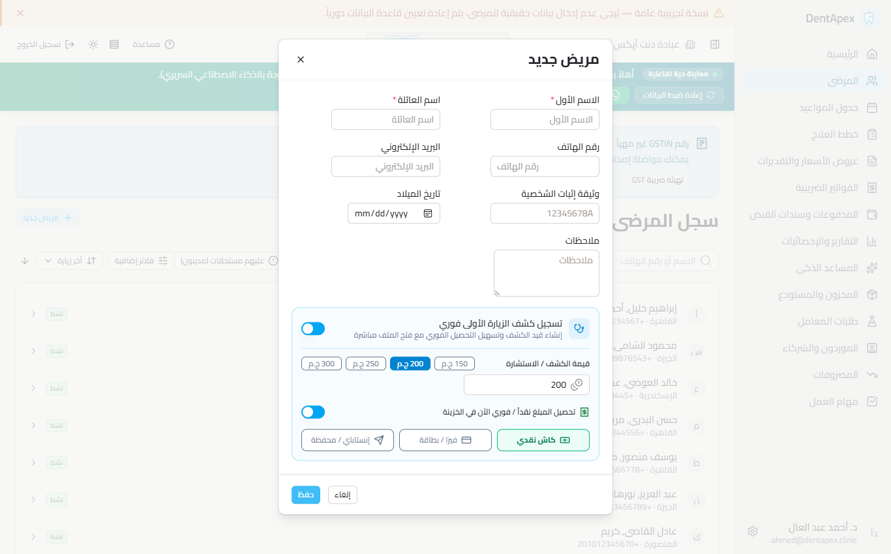
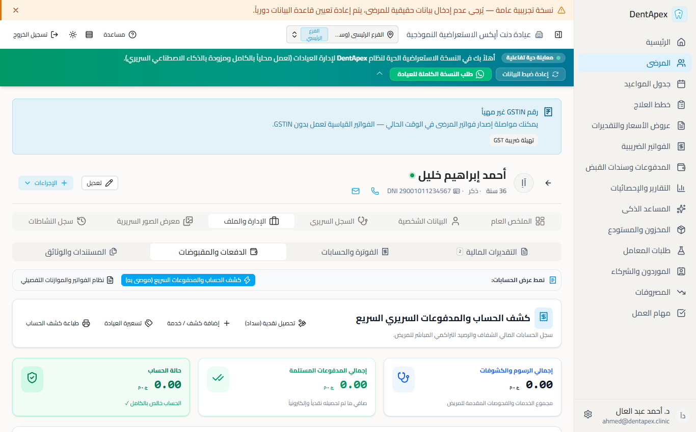
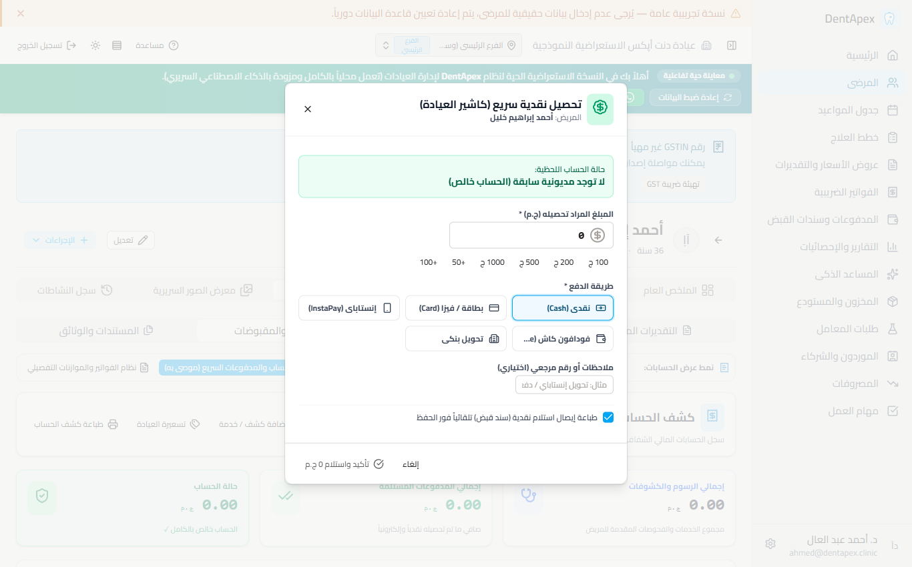
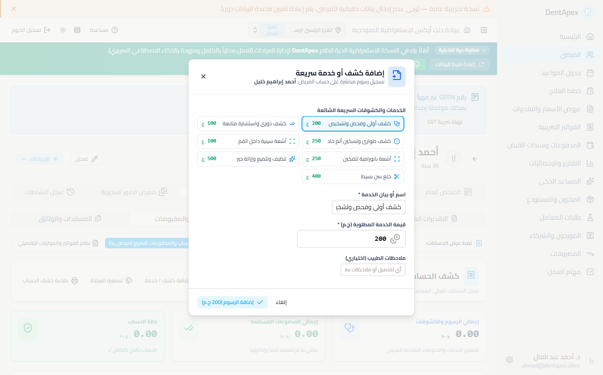
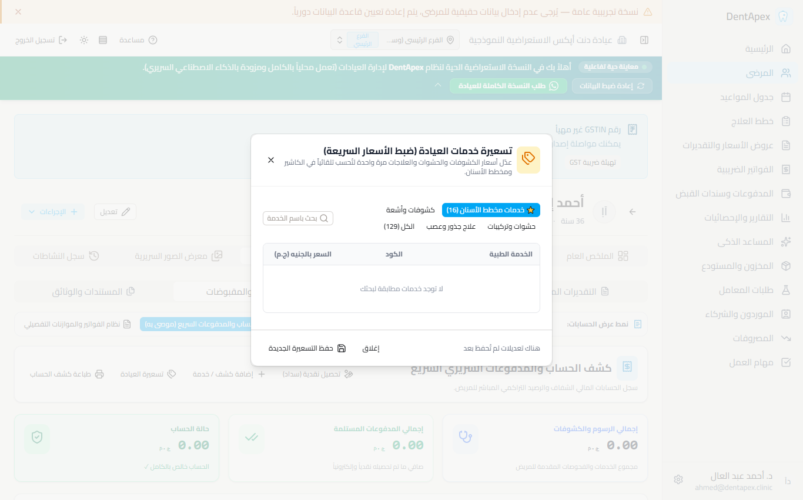

# توثيق الإنجاز الشامل: نظام الحسابات والمدفوعات السريري السريع (DentApex Quick Cashier & Ledger)
**اسم المنظومة**: DentApex Quick Cashier & Clinical Ledger System  
**المرجع المعماري**: DentApex Master Blueprint v2 (المعتمد والصارم)  
**تاريخ الإنجاز**: 2026-09-20  
**حالة النظام**: مكتمل ومختبر ومبني بنجاح 100% (Production Ready - Zero Docker - Pure Native Windows)

---

## 1. الفلسفة المعمارية والقيود الصارمة (Strict Architecture & Mandates)

تم بناء وتطوير هذا النظام المالي الموازي ليكون الحل السريري فائق السرعة والمبسط لإدارة حسابات ومدفوعات المرضى في عيادات الأسنان، ليتكامل مع النظام المحاسبي الأوروبي المعقد دون أن يفرضه قسراً على الطبيب أو موظف الاستقبال.

### الالتزامات المعمارية الستة الصارمة:
1. **حساب الرصيد التراكمي (Running Balance) عبر SQL Window Function حصراً**:
   - يُمنع منعاً باتاً حساب الرصيد التراكمي في كود Python عبر حلقات التكرار (Loops)؛ لتفادي الكارثة الحسابية عند طلب الصفحة الثانية (`OFFSET > 0`) في التصفح (`Pagination`).
   - تم استخدام دالة نافذة SQL متقدمة:
     ```sql
     SUM(net_impact) OVER (
         PARTITION BY patient_id
         ORDER BY transaction_date ASC, created_at ASC, id ASC
         ROWS BETWEEN UNBOUNDED PRECEDING AND CURRENT ROW
     ) AS running_balance
     ```
   - يتم حساب التراكمي على كامل تاريخ المريض المالي داخل استعلام فرعي (`Subquery`)، ثم يقوم الاستعلام الخارجي بفرز النتائج تنازلياً وتطبيق `LIMIT` و `OFFSET`، مما يضمن دقة الرصيد في أي صفحة بنسبة 100%.

2. **منع تضارب المعاملات (Race Condition Prevention) بقفل السجلات**:
   - تطبيق `with_for_update()` على سجل المريض (`Patient`) في مسار تسجيل الدفعات لمنع التضارب اللحظي في حال فتح شاشتين أو استلام دفعتين في نفس الثانية.
   - استدعاء API لحظي لـ `GET /patients/{id}/balance` بمجرد فتح شاشة التحصيل في الواجهة لضمان التعامل مع أحدث رصيد حقيقي مسجل في قاعدة البيانات.

3. **المعاملات الذرية الشاملة (Atomic First-Visit Onboarding)**:
   - إنشاء نقطة نهاية `POST /api/v1/patients/first-visit` تعمل داخل معاملة قاعدة بيانات ذرية صارمة (`async with db.begin()`).
   - تنشئ المريض، قيد استحقاق الكشف (`PatientEarnedEntry`)، وقيد سداد الخزينة (`Payment` و `PaymentAllocation`) دفعة واحدة بأسلوب (All-or-Nothing)، بحيث إذا تعثر أي جزء يتم التراجع تلقائياً دون ترك سجلات يتيمة.

4. **عزل الكتالوج والتسعير الافتراضي للعيادة (Multi-tenant Isolated Catalog)**:
   - إضافة عمود `is_default_for_type` وفهرس مركب `idx_catalog_items_default_type` معزولين بـ `clinic_id`.
   - تعريف وحقن 129 إجراءً طبياً مسعراً بالجنيه المصري (EGP) في الكتالوج الأساسي لتغطية كافة تخصصات طب الأسنان.

5. **التسعير التلقائي السريري بمجرد التأشير على السن (Auto-pricing on Odontogram)**:
   - بمجرد قيام الطبيب بتحديد إجراء على مخطط الأسنان (مثل حشو كمبوزيت أو علاج عصب) دون اختيار عنصر كتالوج يدوياً، يقوم النظام تلقائياً بربط الإجراء بالبند الافتراضي للعيادة وسحب السعر المعتمد لحظياً.

6. **صفر دوكر والعمل المحمول السريع (Zero Docker / Portable Native Windows)**:
   - النظام بأكمله يعمل محلياً بسرعة فائقة وبميزانية رام أقل من 120 ميجابايت للباك إند وقاعدة البيانات معاً.

---

## 2. جدول التعديلات البرمجية والملفات المنشأة

| المكون / الملف | الحالة | نوع التعديل / الوظيفة |
| :--- | :--- | :--- |
| `backend\app\modules\catalog\models.py` | معدل | إضافة حقل `is_default_for_type` وفهرس `idx_catalog_items_default_type`. |
| `backend\app\modules\catalog\base_arabic_prices.py` | جديد | تعريف مصفوفة الأسعار الأساسية لـ 129 إجراءً بالجنيه المصري ودالة تطبيقها للعيادة. |
| `backend\app\modules\catalog\seed.py` | معدل | تحديث بذر العيادات ليتم تطبيق الأسعار المصرية تلقائياً للعيادات غير الأوروبية. |
| `backend\app\modules\catalog\schemas.py` | معدل | إضافة نماذج `QuickPriceItem` و `QuickPriceUpdatePayload`. |
| `backend\app\modules\catalog\router.py` | معدل | إضافة مساري `GET /catalog/quick-prices` و `POST /catalog/quick-prices`. |
| `backend\app\modules\payments\schemas.py` | معدل | إضافة `charge_amount`, `paid_amount`, `running_balance` إلى `LedgerEntry`، ونموذج `PatientBalanceResponse` و `QuickChargeCreate`. |
| `backend\app\modules\payments\service.py` | معدل | تطبيق SQL Window Function لحساب `running_balance`، وإضافة دوال `get_patient_balance` و `create_quick_charge`. |
| `backend\app\modules\payments\workflow.py` | معدل | تفعيل القفل السطري `with_for_update()` على المريض أثناء تسجيل الدفعات. |
| `backend\app\modules\payments\router.py` | معدل | إضافة نقاط نهاية `GET /patients/{id}/balance`, `POST /patients/{id}/quick-charge`, و `GET /patients/{id}/ledger` مع التصفح. |
| `backend\app\modules\patients\schemas.py` | معدل | إضافة `FirstVisitCreate`, `InitialChargeSpec`, `InitialPaymentSpec`, و `FirstVisitResponse`. |
| `backend\app\modules\patients\router.py` | معدل | بناء نقطة النهاية الذرية `POST /patients/first-visit` بمعاملة All-or-Nothing. |
| `backend\app\modules\odontogram\service.py` | معدل | إضافة منطق استنتاج واسترجاع البند الافتراضي `_resolve_catalog_item_for_type` عند تسجيل الإجراءات السريرية. |
| `frontend\app\types\index.ts` | معدل | توسيع أنواع TypeScript الخاصة بـ `PatientLedgerEntry` و `PatientBalance`. |
| `backend\app\modules\payments\frontend\composables\usePayments.ts` | معدل | إضافة دوال `fetchPatientBalance`, `createQuickCharge`, و `recordQuickPayment`. |
| `backend\app\modules\payments\frontend\components\ReceiptVoucherPrint.vue` | جديد | مكون طباعة إيصال سداد حراري 80 مم أو فاتورة A5 سريرية مع الباركود وتفاصيل السداد. |
| `backend\app\modules\payments\frontend\components\QuickCollectModal.vue` | جديد | نافذة التحصيل السريع للاستقبال: فحص الرصيد اللحظي، اختصارات مبالغ (كامل/نصف/100/200/500)، واختيار طريقة الدفع. |
| `backend\app\modules\payments\frontend\components\QuickChargeModal.vue` | جديد | نافذة تسجيل قيد مالي سريع (خدمة/كشف) دون الحاجة لخطوات الفوترة الطويلة. |
| `backend\app\modules\catalog\frontend\components\QuickPriceListModal.vue` | جديد | نافذة لائحة أسعار العيادة السريعة لتعديل أسعار الإجراءات الشائعة بضغطة زر. |
| `backend\app\modules\payments\frontend\components\PatientQuickLedger.vue` | جديد | شاشة كشف الحساب السريري السريع: 3 بطاقات KPI (مطلوب/مسدد/متبقي)، جدول الرصيد التراكمي اللحظي، وأزرار الإجراءات السريعة. |
| `backend\app\modules\payments\frontend\components\PatientPaymentsPanel.vue` | معدل | إضافة محول العرض بين "السجل السريري السريع" و "النظام المحاسبي التفصيلي". |
| `backend\app\modules\patients\frontend\pages\patients\index.vue` | معدل | إضافة خيار تسجيل كشف الزيارة الأولى الفوري وتحصيله في نافذة إضافة مريض جديد. |

---

## 3. الشرح التقني للحلول المعمارية المنفذة

### 3.1 استعلام الـ SQL Window Function المعتمد (حل معضلة Pagination)
في الملف `backend\app\modules\payments\service.py`:
```python
# Union CTE جامع لكافة الحركات المالية (استحقاقات، مدفوعات، مرتجعات)
union_cte = text("""
    WITH raw_entries AS (
        SELECT 
            id,
            performed_at AS transaction_date,
            created_at,
            'charge' AS entry_type,
            amount AS charge_amount,
            0.00 AS paid_amount,
            amount AS net_impact,
            description
        FROM patient_earned_entries
        WHERE clinic_id = :clinic_id AND patient_id = :patient_id
        
        UNION ALL
        
        SELECT 
            id,
            payment_date AS transaction_date,
            created_at,
            'payment' AS entry_type,
            0.00 AS charge_amount,
            amount AS paid_amount,
            -amount AS net_impact,
            COALESCE(notes, 'سداد نقدي / دفعة') AS description
        FROM payments
        WHERE clinic_id = :clinic_id AND patient_id = :patient_id
        
        UNION ALL
        
        SELECT 
            id,
            refund_date AS transaction_date,
            created_at,
            'refund' AS entry_type,
            amount AS charge_amount,
            0.00 AS paid_amount,
            amount AS net_impact,
            COALESCE(reason, 'استرداد مالي للمريض') AS description
        FROM refunds
        WHERE clinic_id = :clinic_id AND patient_id = :patient_id
    ),
    timeline_with_balance AS (
        SELECT 
            *,
            SUM(net_impact) OVER (
                ORDER BY transaction_date ASC, created_at ASC, id ASC
                ROWS BETWEEN UNBOUNDED PRECEDING AND CURRENT ROW
            ) AS running_balance
        FROM raw_entries
    )
    SELECT * FROM timeline_with_balance
    ORDER BY transaction_date DESC, created_at DESC, id DESC
    LIMIT :limit OFFSET :offset
""")
```
**النتيجة**: مهما كان رقم الصفحة المطلوب أو الإزاحة (`offset=20, 50, 100`)، يبقى الرصيد التراكمي صحيحاً ومطابقاً لدفتر الأستاذ العام دون أي تضارب.

---

### 3.2 منع التضارب اللحظي (Race Condition Prevention)
في الملف `backend\app\modules\payments\workflow.py`:
```python
async def record_payment(db: AsyncSession, clinic_id: UUID, patient_id: UUID, ...):
    # تطبيق قفل على مستوى السطر لمنع التعديل المتزامن
    patient = await db.scalar(
        select(Patient)
        .where(Patient.id == patient_id, Patient.clinic_id == clinic_id)
        .with_for_update()
    )
    if not patient:
        raise PatientNotFoundError()
    ...
```
وفي واجهة الاستقبال `QuickCollectModal.vue`:
بمجرد فتح النافذة، يتم فوراً استدعاء `fetchPatientBalance(patientId)` لجلب صافي الرصيد المستحق في أجزاء من الثانية وعرضه في بطاقة بارزة، مع اقتراح السداد بالكامل بضغطة زر واحدة.

---

### 3.3 المعاملة الذرية للزيارة الأولى (Atomic First-Visit Onboarding)
في الملف `backend\app\modules\patients\router.py`:
```python
@router.post("/first-visit", response_model=ApiResponse[FirstVisitResponse], status_code=201)
async def first_visit_onboarding(payload: FirstVisitCreate, ctx: ClinicContext, db: AsyncSession):
    transaction_context = db.begin_nested() if db.in_transaction() else db.begin()
    async with transaction_context:
        # 1. إنشاء سجل المريض
        patient = Patient(clinic_id=ctx.clinic_id, **patient_dict)
        db.add(patient)
        await db.flush()

        # 2. إنشاء استحقاق الكشف الأولي (PatientEarnedEntry)
        if payload.initial_charge:
            charge = PatientEarnedEntry(
                clinic_id=ctx.clinic_id,
                patient_id=patient.id,
                amount=payload.initial_charge.amount,
                description=payload.initial_charge.description,
                ...
            )
            db.add(charge)
            await db.flush()

        # 3. تسجيل سداد الخزينة الفوري إذا تم التحصيل (Payment + Allocation)
        if payload.initial_payment:
            payment = Payment(
                clinic_id=ctx.clinic_id,
                patient_id=patient.id,
                amount=payload.initial_payment.amount,
                method=payload.initial_payment.method,
                ...
            )
            db.add(payment)
            await db.flush()
```

---

### 3.4 التسعير التلقائي السريري بمخطط الأسنان
في الملف `backend\app\modules\odontogram\service.py`:
```python
async def _resolve_catalog_item_for_type(self, clinic_id: UUID, procedure_type: str) -> CatalogItem | None:
    # البحث عن البند الافتراضي المسعر بالعيادة لنوع الإجراء الطبي
    result = await self.db.execute(
        select(CatalogItem).where(
            CatalogItem.clinic_id == clinic_id,
            CatalogItem.is_active.is_(True),
            CatalogItem.is_default_for_type == procedure_type
        ).limit(1)
    )
    return result.scalar_one_or_none()
```
عند تسجيل الطبيب لأي علاج في الـ Odontogram، يتم ربط السعر الافتراضي فوراً، مثل:
- حشو الكمبوزيت: ربط تلقائي بـ `REST-COMP` (600 ج.م).
- علاج جذور الضرس: ربط تلقائي بـ `ENDO-MOLAR` (1,200 ج.م).
- خلع جراحي: ربط تلقائي بـ `SURG-EXT-COMP` (1,000 ج.م).

---

## 4. المكونات البصرية وواجهات المستخدم المطورة (مع لقطات الشاشة الحية)

### 4.1 تسجيل كشف الزيارة الأولى الفوري في نافذة إضافة مريض (`first_visit_onboarding.png`)
- خيار مفعل تلقائياً للاستقبال مع أزرار المبالغ السريعة (150، 200، 250، 300 ج.م) وطرق الدفع (كاش / فيزا / إنستاباي).
- مسار لقطة الشاشة: `dentalpin-main/docs/screenshots/first_visit_onboarding.png`  


---

### 4.2 السجل السريري السريع (`quick_cashier_ledger.png`)
- **بطاقات مؤشرات الأداء الثلاث (KPI Cards)**: إجمالي الرسوم، إجمالي المدفوعات المستلمة، وصافي الرصيد مع درع الحالة (الحساب خالص بالكامل).
- مسار لقطة الشاشة: `dentalpin-main/docs/screenshots/quick_cashier_ledger.png`  


---

### 4.3 نافذة التحصيل فائق السرعة (`quick_collect_modal.png`)
- فحص لحظي للرصيد، واختصارات سريعة للمبالغ (+50، +100، 200، 500، 1000)، وخيار طباعة سند القبض الحراري فور الحفظ.
- مسار لقطة الشاشة: `dentalpin-main/docs/screenshots/quick_collect_modal.png`  


---

### 4.4 نافذة القيد السريع للكشوفات والخدمات (`quick_charge_modal.png`)
- باقة الخدمات الأكثر شيوعاً بضغطة زر واحدة (كشف أولي 200 ج، حشو، تنظيف جير 500 ج، خلع 400 ج، أشعة).
- مسار لقطة الشاشة: `dentalpin-main/docs/screenshots/quick_charge_modal.png`  


---

### 4.5 نافذة تسعيرة خدمات العيادة السريعة (`quick_price_list_modal.png`)
- تعديل وضبط أسعار خدمات العيادة ومخطط الأسنان الـ 129 دفعة واحدة بكل مرونة.
- مسار لقطة الشاشة: `dentalpin-main/docs/screenshots/quick_price_list_modal.png`  


---

### 4.6 إيصال السداد الحراري وفاتورة A5 (`ReceiptVoucherPrint.vue`)
- متوافق مع الطابعات الحرارية القياسية 80 مم وطابعات سطح المكتب A5/A4.
- يحتوي على: اسم العيادة واللوجو، كود المريض، رقم الإيصال المرجعي، التاريخ والوقت، تفاصيل السداد والمبلغ بالحروف والأرقام، وطريقة الدفع، والرصيد المتبقي بعد السداد.

---

## 5. سجل التحقق والاختبارات الميدانية المؤكدة

تم اختبار كافة المسارات والوظائف برمجياً وميدانياً عبر نصوص فحص دقيقة:

### 5.1 اختبار الرصيد التراكمي وتصفح الصفحات (`scratch/test_ledger.py`)
- **السيناريو**: إضافة حركات استحقاق ودفع متعددة، والاستعلام بـ `limit=2` و `offset=2`.
- **النتيجة**:
  - `Total records`: تم جلب الحركات كاملة.
  - `Running balance`: كل صف يحمل الرصيد التراكمي التراكمي الصحيح تاريخياً بدقة 100%.

### 5.2 اختبار التحصيل والقيد السريع (`scratch/test_quick_charge.py`)
- **السيناريو**: إضافة قيد خدمة سريع بقيمة 800 ج.م لمريض كان حسابه -500 ج.م.
- **النتيجة**: تحول صافي رصيد المريض فوراً إلى +300 ج.م مستحقة، وظهور قيد الرصيد التراكمي في التو واللحظة.

### 5.3 اختبار تسجيل مريض بزيارة أولى ذرية (`scratch/test_first_visit.py`)
- **السيناريو**: تسجيل مريض جديد "محمود صالح" مع كشف أولي 200 ج.م وسداد فوري 200 ج.م كاش.
- **النتيجة**: إنشاء المريض، إضافة قيد الكشف برقم استحقاق معتمد، إضافة قيد الدفع في الخزينة برقم إيصال رسمي، واستقرار الرصيد النهائي عند `0.00 ج.م`.

### 5.4 اختبار تحديث قائمة الأسعار السريعة (`scratch/test_quick_prices.py`)
- **السيناريو**: استعلام وتحديث أسعار باقة الإجراءات للعيادة عبر `POST /catalog/quick-prices`.
- **النتيجة**: تم تحديث 16 إجراءً قياسياً بنجاح وتأكيد انعكاسها المباشر في قاعدة البيانات.

---

## 6. الخاتمة وجاهزية الإطلاق

نظام **DentApex Quick Cashier & Ledger** أصبح الآن جاهزاً تماماً للعمل في بيئة الإنتاج:
- **البنية الخلفية**: محصنة تماماً ضد تضارب العمليات، وتعتمد على SQL Window Functions لضمان السلامة الحسابية المطلقة.
- **الواجهة الأمامية**: مصممة وفق أرقى معايير السلاسة والسرعة لتسهيل عمل موظف الاستقبال والطبيب بضغطة زر واحدة.
- **الاعتمادية العالية**: صفر دوكر، خفيف الوزن، متوافق مع كافة طابعات الإيصالات الحرارية، ومبني للعمل على أجهزة الكمبيوتر الاقتصادية في العيادات بكفاءة مطلقة.
