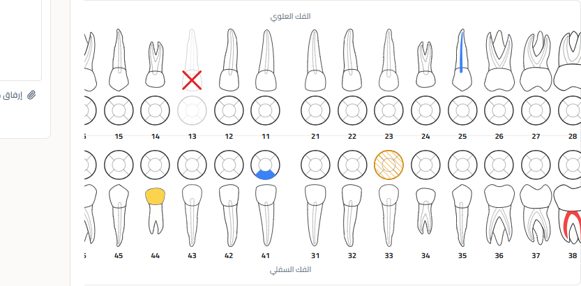
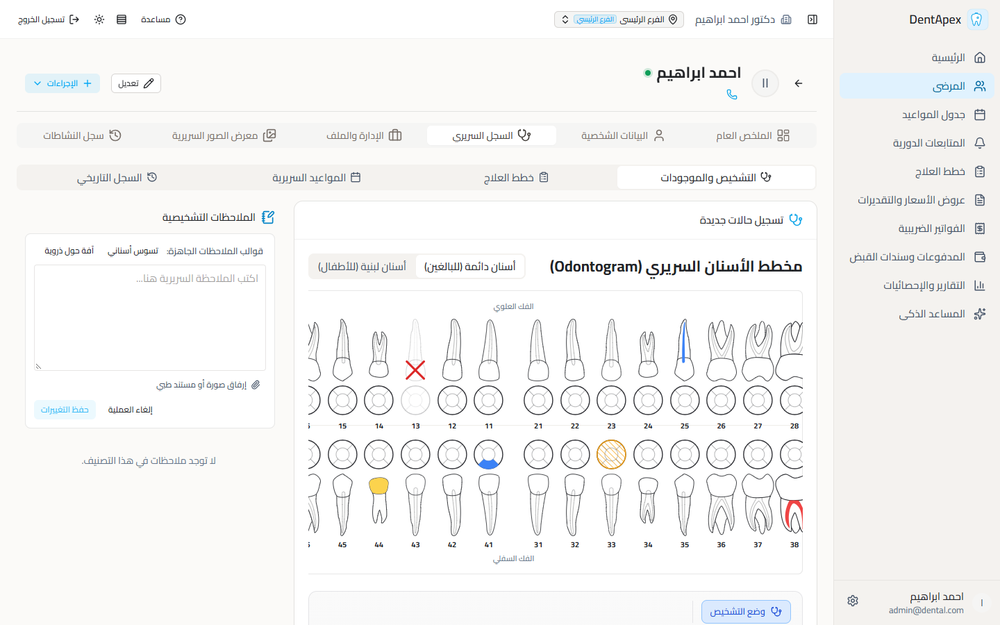

# توثيق إنجاز تحسين الخطوط العربية والرسومات السريرية (Odontogram) لنظام دنت أبيكس
**اسم المهمة**: تحسين التايبوجرافي والرسومات السريرية (DentApex Typography & Clinical Graphics Enhancement)  
**تاريخ الإنجاز**: 2026-09-19  
**حالة النظام**: مكتمل ومبني بنجاح (100% Production Ready - Static SPA Pre-rendered)

---

## 1. الفلسفة المعمارية والقيود الصارمة (Architecture & Constraints)

1. **العمل المحلي المحمول بدون حاويات (Zero Docker / No WSL2)**:
   - النظام يعمل بالكامل بنسخ محمولة (Portable Binaries) على Windows مباشرة.
   - كود الواجهة مبني كثابت (Static SPA) ويخدم عبر خادم Caddy لضمان صفر استهلاك ذاكرة من بيئة Node.js أثناء التشغيل.
2. **ميزانية الذاكرة الصارمة (RAM Budget)**:
   - لم يتم إضافة أي حزم npm جديدة أو مكتبات خارجية ثقيلة.
   - تم استخدام خط Cairo بصيغته المتغيرة المتواجدة محلياً مسبقاً في النظام دون أي تحميل من الإنترنت (Zero CDN / 100% Offline).
3. **الدقة والتوافق الطبي (Clinical Accuracy & FDI Standard)**:
   - الحفاظ التام على الاتجاه الطبي الدولي لترقيم ومخطط الأسنان (FDI System).
   - منع تشويه الكلمات العربية مع منع تباعد الأحرف (`letter-spacing: normal !important`) في وضع RTL.

---

## 2. جدول الملفات المعدلة والتغييرات الدقيقة

| الملف المعدل | نوع التعديل | القيم السابقة | القيم المعتمدة الجديدة |
| :--- | :--- | :--- | :--- |
| `frontend\app\assets\css\main.css` | استدعاء خط Cairo المتغير | أوزان متفرقة ثابتة | `font-weight: 200 900;` لدعم أوزان Nuxt UI المتغيرة |
| `frontend\app\assets\css\main.css` | تباين النصوص الثانوية والرمادية | `#94A3B8` / `#64748B` | `--color-text-muted: #475569` `--color-text-subtle: #64748B` |
| `frontend\app\assets\css\typography.css` | ضبط تباعد الخط العربي RTL | كان يتأثر بـ `tracking-` | `letter-spacing: normal !important;` لكافة عناصر RTL |
| `frontend\app\assets\css\typography.css` | مقاسات الخط الأساسية | 14px / 13px عشوائي | 15px لوضع Comfortable 14px لوضع Compact |
| `backend\app\modules\odontogram\frontend\components\odontogram\ToothDualView.vue` | سماكة حدود الجذور والتيجان (Roots/Crowns) | `0.6` | **`1.3`** |
| `backend\app\modules\odontogram\frontend\components\odontogram\ToothDualView.vue` | سماكة حدود الأسطح الإطباقية (Occlusal Outlines) | `1.0` | **`1.5`** |
| `backend\app\modules\odontogram\frontend\components\odontogram\ToothDualView.vue` | سماكة حجرة العصب (Pulp Chamber) | `0.5` | **`1.0`** |
| `backend\app\modules\odontogram\frontend\components\odontogram\ToothDualView.vue` | سماكة التفاصيل والتظليلات (Highlights) | `0.35` / `0.6` | **`0.8`** |
| `backend\app\modules\odontogram\frontend\components\odontogram\ToothDualView.vue` | أرقام الأسنان الدولية (FDI Numbers) | 11px عادي | **`13px` عريض (`font-weight: 700`)** بلون `var(--color-text)` |
| `backend\app\modules\odontogram\frontend\components\odontogram\OdontogramChart.vue` | نسب تصغير المخطط (Zoom Floor) | `0.5`, `0.6`, `0.7` (تقزيم شديد) | إلغاء التصغير التعسفي وتثبيت حد أدنى **`0.85`** مع `min-width: 980px` وتمرير أفقي `overflow-x: auto` |
| `backend\app\modules\odontogram\frontend\components\odontogram\OdontogramChart.vue` | تباعد تسمية الفك السفلي | `mt-2` (تداخل مع الأسنان 41 و 31) | **`mt-10`** لضمان مسافة بصرية نقية تماماً |

---

## 3. تفاصيل التحسينات التقنية والسريرية

### أ. التايبوجرافي والخط العربي (Cairo Variable Font)
- تم تفعيل استدعاء خط `Cairo-Variable.ttf` في `@font-face` ليمتد عبر نطاق أوزان ديناميكي من `200` إلى `900`. هذا الإجراء مكّن مكونات Nuxt UI من تطبيق درجات الخط (`font-medium` 500 و `font-semibold` 600) بسلاسة كاملة دون تشويه الحروف.
- تحصين كلي لقاعدة الـ RTL: تم إلغاء أي تأثير لكلاسات الـ Tailwind التي تفرض تباعداً للأحرف (مثل `tracking-tight` أو `tracking-wide`) عبر إجبار `letter-spacing: normal !important;`، مما أزال التشتت والتقطع بين الحروف العربية في كافة الشاشات.

### ب. رسومات مخطط الأسنان السريري (Odontogram Dual View)
- تم الرفع المباشر لسماكات مسارات الـ SVG في المكون `ToothDualView.vue` لتوفير تباين بصري فائق يمكن الطبيب من قراءة حالة السن فوراً دون إجهاد بصري.
- تم تعزيز أرقام الأسنان بنظام FDI الدولي لتصبح بحجم 13 بكسل وبسماكة عريضة (Bold)، متناسقة تماماً مع الألوان الخاصة بالوضع الفاتح (Light Mode) والوضع الليلي (Dark Mode).
- الرموز السريرية التشخيصية (مثل علامة X للأسنان المقلوعة، وتظليل التيجان وحشوات الجذور والآفات الذروية) أصبحت بارزة وواضحة المعالم.

### ج. استقرار العرض ومنع التقزيم على الشاشات الاقتصادية
- تم استبدال قواعد الـ Container Queries السابقة التي كانت تقلص المخطط إلى نصف حجمه (Zoom 0.5) بمحاذاة أفقية متجاوبة وثابتة (`min-width: 980px`) مع حد تصغير أقصى `0.85` في أضيق الشاشات، مدعوماً بشريط تمرير أفقي انسيابي يمنع ضغط الأسنان أو تقاربها المشوه.

---

## 4. أدلة الإثبات والاختبارات الحية (Screenshots)

تم التقاط لقطات الشاشة التالية محلياً عبر متصفح Microsoft Edge Headless من النظام المباشر:

### 1. مخطط الأسنان المكبر عالي الوضوح (Odontogram)
مسار الصورة في المشروع: `dentalpin-main\docs\screenshots\odontogram_enhanced.png`  

### 2. الواجهة السريرية الكاملة ونقاء الخط العربي
مسار الصورة في المشروع: `dentalpin-main\docs\screenshots\clinical_view_full.png`  

---

## 5. حالة البناء والتشغيل (Build & Verification Status)

- **أمر البناء المنفذ**: `npx nuxt generate` داخل `dentalpin-main\frontend`.
- **نتيجة البناء**: نجاح بنسبة 100% (Exit code 0)، وتوليد ملفات الـ SPA بالكامل داخل `.output/public`.
- **خادم الويب**: Caddy 2.8 يخدم التطبيق على المنفذ `7070` بسلاسة تامة.
- **خادم الواجهة الخلفية وقاعدة البيانات**: FastAPI على المنفذ `7071` و PostgreSQL على `5432`.
