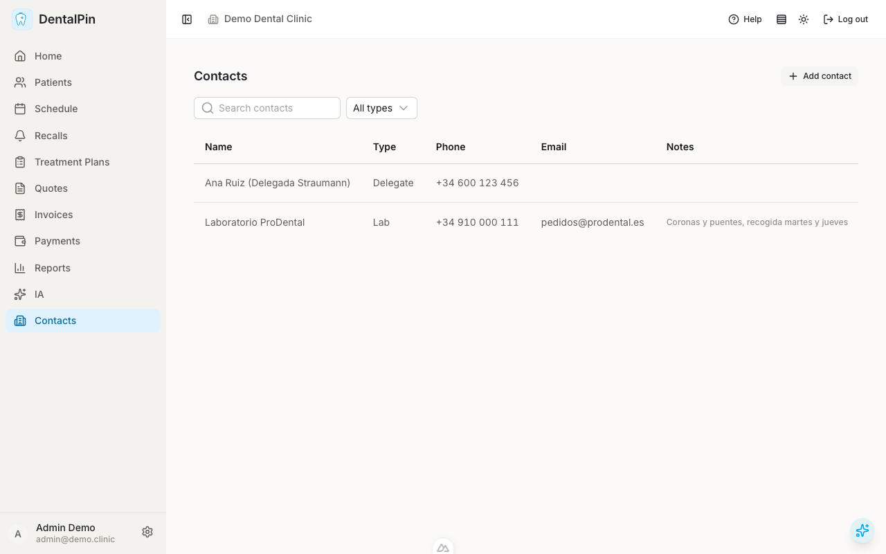

# Contact directory

Lists the clinic's external provider contacts. From here you can
search, filter by type, add a new contact, edit one, or deactivate one.

## At a glance

- **Search** matches the contact's name and notes.
- **Type filter** narrows the list to labs, suppliers, delegates, or
  other; *All types* clears it.
- The table shows name, type, phone, email, and a one-line preview of
  the notes (hover to read the full text).
- On small screens the table scrolls sideways inside its own container.

## Adding and editing

**Add contact** (or the pencil icon on a row) opens a modal with name
(required), type, phone, email, address, and notes. *Save* stays
disabled until a name is entered.

## Deleting

The trash icon asks for confirmation, then **deactivates** the contact:
it disappears from the default list but is kept in the database so
historical records that reference it remain intact. Users with write
permission can restore one via the API (`PATCH` with
`is_active: true`); a restore UI will come with the lab-orders module.
