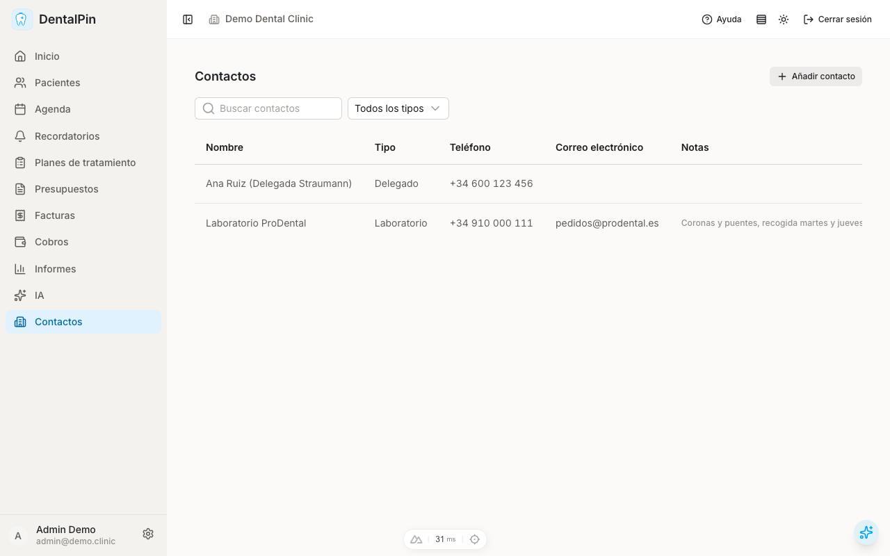
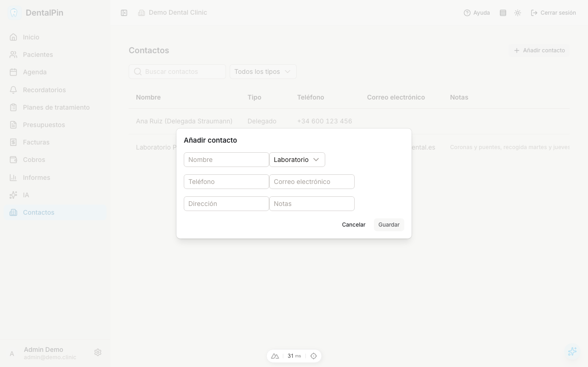

# Directorio de contactos

Lista los contactos de proveedores externos de la clínica. Desde aquí
puedes buscar, filtrar por tipo, dar de alta un contacto, editarlo o
desactivarlo.

## De un vistazo

- El **buscador** busca en el nombre y en las notas del contacto.
- El **filtro por tipo** limita la lista a laboratorios, proveedores,
  delegados u otros; *Todos los tipos* lo limpia.
- La tabla muestra nombre, tipo, teléfono, correo y una línea de las
  notas (pasa el cursor para leer el texto completo).
- En pantallas pequeñas la tabla se desplaza lateralmente dentro de su
  propio contenedor.

## Alta y edición

**Añadir contacto** (o el icono de lápiz en una fila) abre un modal con
nombre (obligatorio), tipo, teléfono, correo, dirección y notas.
*Guardar* permanece deshabilitado hasta introducir un nombre.

## Eliminación

El icono de papelera pide confirmación y después **desactiva** el
contacto: desaparece de la lista por defecto pero se conserva en la
base de datos para que los registros históricos que lo referencien
sigan intactos. Con permiso de escritura se puede restaurar vía API
(`PATCH` con `is_active: true`); la interfaz de restauración llegará
con el módulo de pedidos a laboratorio.
